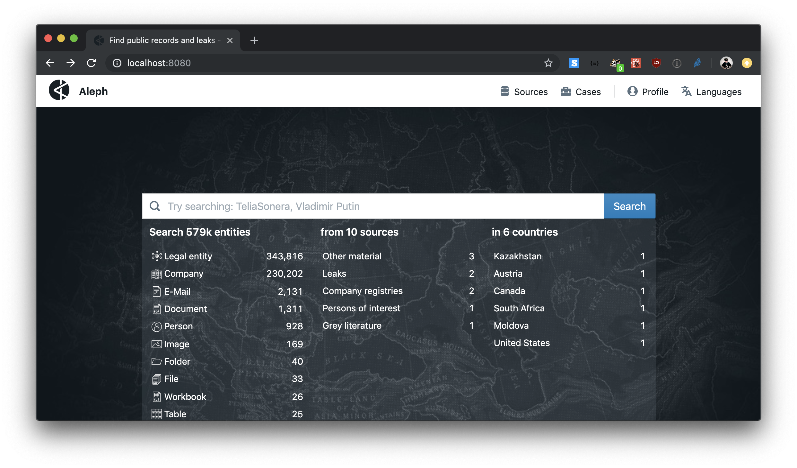

# Welcome

Aleph is a powerful tool for people who follow the money. It helps investigators to **securely access and search large amounts of data** - no matter whether they are a government database or a leaked email archive.

## Aleph for users

If you're a reporter or other user of Aleph, you can find out **how to search Aleph**, **sketch out networks of people and assets**, **upload your own data**, or **link Aleph with other tools**.







## Aleph for developers and admins

From a technical perspective, Aleph is a whole **suite of open source tools**. Besides running and configuring the Aleph server, the documentation also covers separate tools that are used to process data flexibly, interact with Aleph, or export data to another format.



The Aleph platform also includes a limited set of open data that are pre-processed to be easily loaded into the site. This includes **OpenSanctions**, a set of crawlers for international lists of sanctions, criminal warrants and of politically exposed people.



## About the name

Aleph is named after a short story written by the Argentinian author Jorge Luis Borges, [The Aleph](http://www.phinnweb.org/links/literature/borges/aleph.html). It tells of a magical place the encapsulates all other places:

_Truth cannot penetrate a closed mind. If all places in the universe are in the Aleph, then all stars, all lamps, all sources of light are in it, too._

