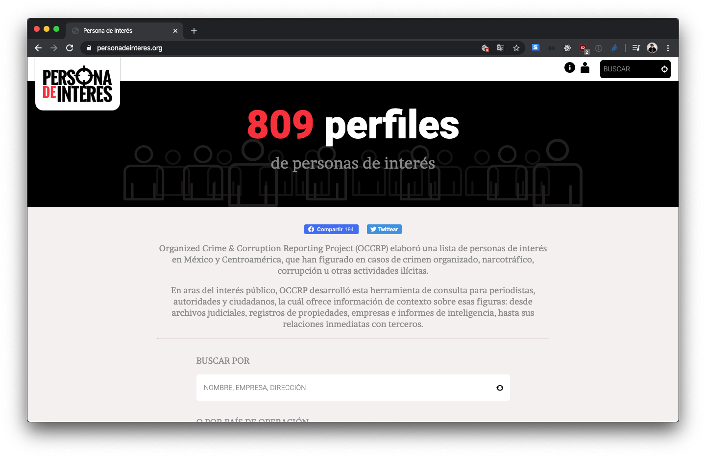
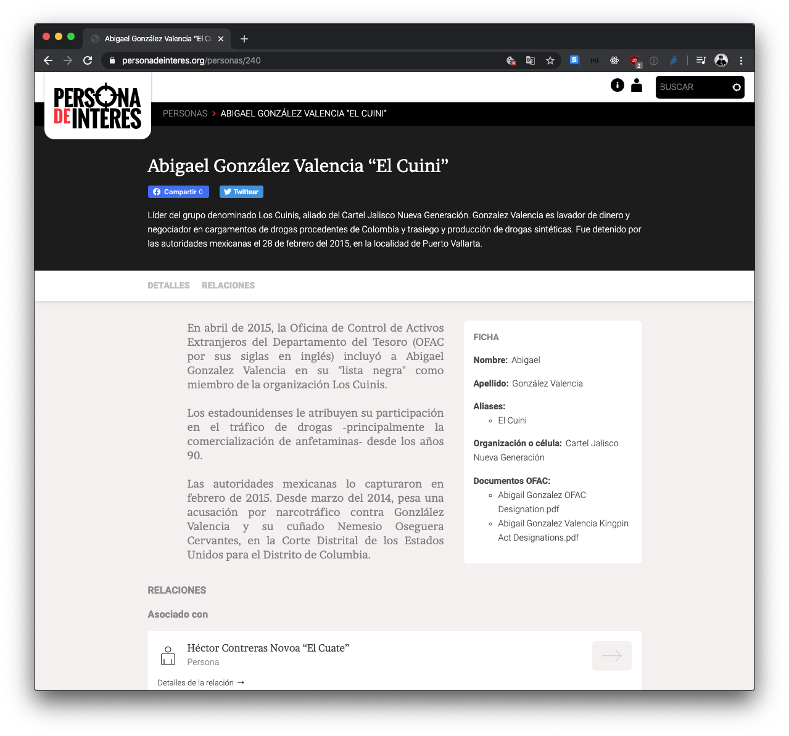
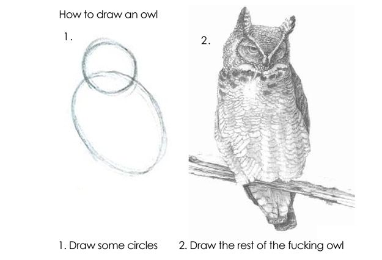

# Mixed document/entity graphs

Probably the most powerful feature of Aleph is the ability to import both structured content and document data from files. While these can be loaded to a collection separately, it sometimes makes sense to create links between entities from structured and unstructured data. The example below demonstrates how to make a mixed graph from documents, people, companies and court cases.

### Why is this complicated?

There are two distinct pathways for loading data into Aleph: either via document ingest for data in PDF, E-Mail or other document formats, or via [data mappings](mappings.md) for semantic data, such as companies and people.

While both processes produce entities in [FollowTheMoney](followthemoney.md) format, there is one crucial difference: for ingested documents, the entity ID is set by Aleph, while for structured entities, you define an ID yourself. At the same time, the entity ID is needed to link to it from other entities.

Therefore, in order to make structured data entities link to ingested documents, you must first upload the documents to Aleph so that it assigns them an ID. Then you can use that entity ID in other parts of the FollowTheMoney entity graph.

### Example: Persona de Interes



**Persona de Interes** is a 2014 project by the OCCRP that features data from Mexico and Central America. It collects information on persons and companies, as well as real estate, court cases and source documents. For this tutorial, we will import the contents of the Persona de Interes web site into Aleph, preserving the connections between people and companies on the one hand, and to documents on the other.


This example is accompanied by [a GitHub repository](https://github.com/alephdata/example-personadeinteres) that contains the full source code, as well as the structured data from **Persona de Interes**.


### **Step 1: Screen-scraping the source data**

In order to get access to the raw data, we decided to simply scrape the PdI web site. The [script used for this](https://github.com/alephdata/example-personadeinteres/blob/master/parse.py) is not central to this tutorial, but it leaves us with a [small JSON file](https://github.com/alephdata/example-personadeinteres/blob/master/pdi.json) containing the published data, and a folder full of the PDF documents attached to profiles on the original site.



### Step 2: Uploading documents to Aleph from a Python script

In the next step, we'll start upload the scraped documents to Aleph. In return, Aleph will give us a document ID, which we can use to make links between the documents and other entities. For the upload, we will use [alephclient](alephclient.md) as a Python library.

The code for uploading a document looks like this:

```python
# Import alephclient:
from alephclient.api import AlephAPI

# By default, alephclient will read host and API key from the 
# environment. You can also pass both as an argument here:
api = AlephAPI()

# Get the collection (dataset)
foreign_id = 'zz_occrp_pdi'
collection = api.load_collection_by_foreign_id(foreign_id)
collection_id = collection.get('id')

file_path = 'www.personadeinteres.org/uploads/example.pdf'
metadata = {'file_name': 'example.pdf'}
# Upload the document:
result = api.ingest_upload(collection_id, file_path, metadata)

# Finally, we have an entity ID:
document_id = result.get('id') 
```

If you visit your Aleph instance, you will see the documents being imported. Eventually, they will show up as searchable entities.

### Step 3: Making FollowTheMoney entities in Python

Once we have received an ID for the document, we can start generating FollowTheMoney entities that link to it. In this scenario, we will not - as usual - be using a [data mapping](mappings.md) to create entities. Instead we'll use the [followthemoney](ftm.md) Python library.

Using the library, we can use the `followthemoney` model definition to generate a so-called entity proxy, an object that can be used to construct an entity.

```python
# Load the followthemoney data model:
from followthemodel import model

# Create an entity proxy by giving a schema:
proxy = model.make_entity('Person')

# Generate an entity ID by hashing the given keys:
proxy.make_id('john-doe')

# Assign a value to a property:
proxy.add('name', 'John Doe')

# Convert the entity proxy to a JSON-like object:
data = proxy.to_dict()

# And the inverse (JSON to proxy):
proxy = model.get_proxy(data)
```

Now that we've made our first person entity, we want to create a link between this person and the document we uploaded before. One way of doing this is to create an `UnknownLink` between the two, a generic link defined by FollowTheMoney:

```python
# Create the link entity proxy:
link_proxy = model.make_entity('UnknownLink')

# We'll derive the link ID from the other two IDs here, but
# this could be any unique value (make sure it does not clash
# with the ID for the main entity!)
link_proxy.make_id('link', proxy.id, document_id)

# Now we assign the two ends of the link. Note that we can just
# pass in a proxy object:
link_proxy.add('subject', proxy)
link_proxy.add('object', document_id)
link_proxy.add('role', 'Document about John')
```

### Step 4: Upload entities to Aleph

Now that we've created a person and a link to the document, we can upload both to Aleph using the `alephclient` API object we created before. For this, note that `alephclient` and `followthemoney` are separate tools, so we need to serialise our proxies into plain JSON-style dicts:

```python
# Turn the two proxies into JSON form:
entities = [proxy.to_dict(), link_proxy.to_dict()]

# You can also feed an iterator to write_entities if you
# want to upload a very large 
api.write_entities(collection_id, entities)
```

When visiting the Aleph UI, you should now be able to see the the person record, the document, and the link between the two shown for each entity.

### Step 5: Convert all the data

Obviously, this basic example needs to expand in order to convert the full data schema from **Persona de Interes into FollowTheMoney** entities. 



Please [check out the loading script](https://github.com/alephdata/example-personadeinteres/blob/master/load.py) to see how it approaches entity creation, and mapping properties from the web scrape into FtM schema. 

### Conclusion

The goal of this tutorial was to show how you can create complex object graphs in Aleph in a way that combines structured and unstructured data. In the course of doing so, we've also shown that `alephclient` and `followthemoney` provide powerful Python libraries. Their full scope exceeds the scope of this Tutorial, but they can be used as power tools to make exciting data structures present in Aleph.

I hope you'll enjoy experimenting with them to show your data in the most expressive way!


You can explore the [Persona de Interes data live on OCCRP's Aleph](https://aleph.occrp.org/datasets/506). 



