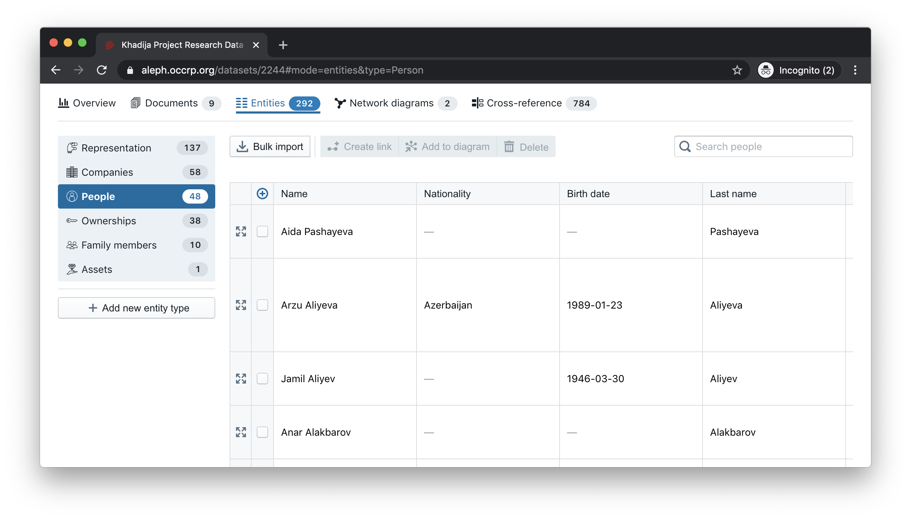
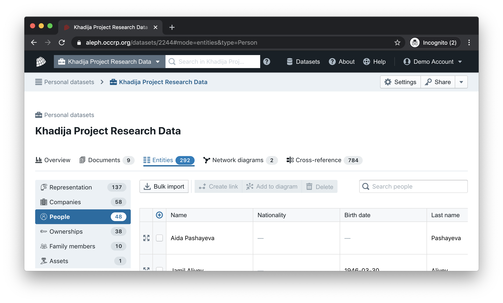
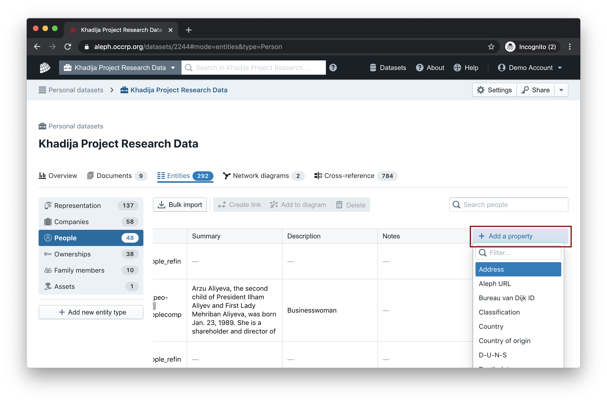
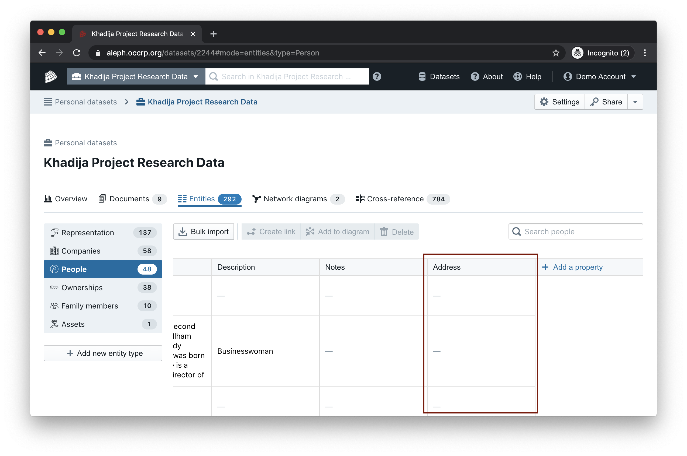
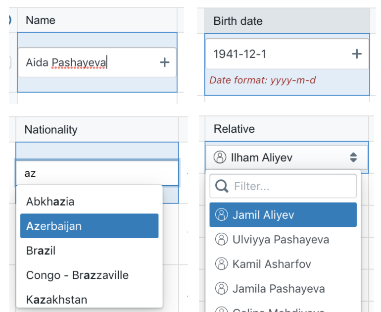
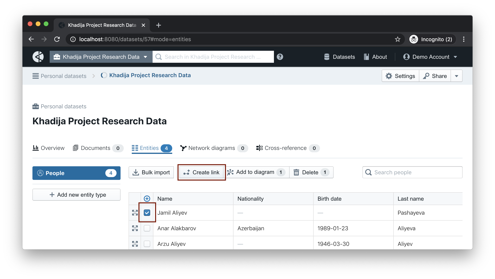
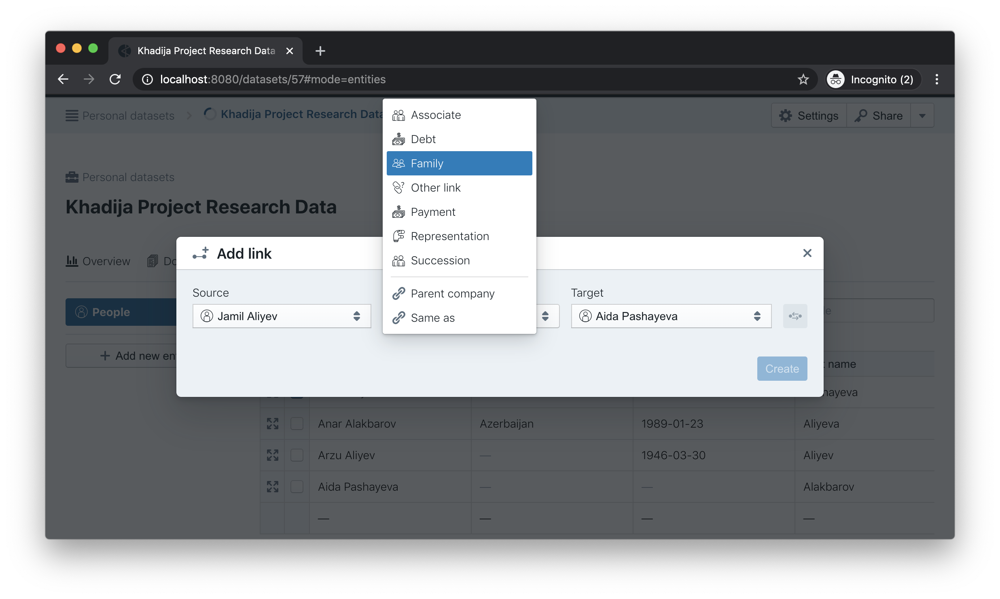
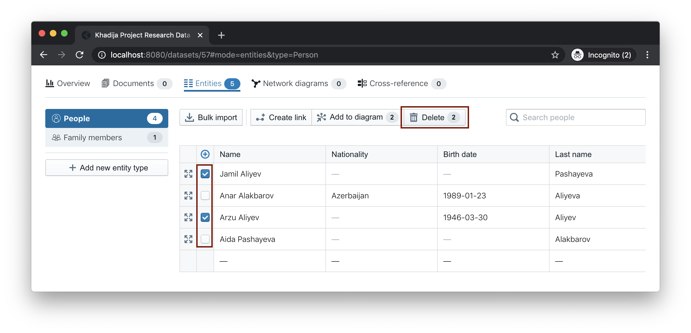

# Using the table editor

The **Table Editor** provides an easy-to-use interface for **creating**, **editing**, **linking**, and **deleting** entities within a Personal Dataset.

To access the Table Editor, click the **"Entities"** tab on any Personal Dataset page.

You will see a table containing all of the entities that have been created within that Personal Dataset, **one entity per row**. **Properties** for each entity are displayed in the corresponding columns.

The table shows only entities of a single type at a time. Use the tabs on the left side to toggle between viewing different types and the **"Add new entity type"** button to add additional types.

## Creating entities

To create a new entity in the Entity Table, either **click the "Add new" button** at the top of the table...

... or simply **start typing** in once of the cells of the bottom row of the table.

Then click **"Enter"** to submit the value for the property cell in which you have typed. A new entity will **automatically be created** with the property value you have entered.

## Editing entities

Editing properties of an entity in the table editor works in much the same way as any spreadsheet editor like Microsoft Excel or Google Sheets. 

* Use the **arrow keys** or **tab key** to navigate the cells of the table
* **Click** in a cell or simply **start typing** in an active cell to edit its contents
* **Click outside** of a cell or press the **enter key** to finish editing a cell
* **Copy** and **paste** the value of a cell or multiple cells to duplicate values in other cells of the table

### Adding Additional Properties

As mentioned above, each column in the table corresponds to a property of the entities contained within. 

By default, the table editor displays the most commonly-used properties of an entity type \(i.e. Name, Nationality, and Birth date for a Person\), as well as any properties that contain values. 

But each entity type has many more additional properties that can be added to the table.

To add an additional property:

1. Scroll to the far right of the table.
2. Click the **"Add a property"** button.
3. Then select a property from the list.

You will now see the column for your property added to the table. **Click** in a cell to start adding values.

### Different property editing types

Properties come in a few different varieties. Most properties, like a person's name or address, are free text values, but other properties, like birth date or nationality are restricted to date or country values, respectively.

When you click to edit a cell, the table editor will display a slightly different editing input, depending upon the type of the property value you are editing. Featured below are a few examples:

### Adding Multiple Values to a Cell

Most entity properties allow for multiple values, if needed. To add multiple values to a cell, click the **plus \(+\)** button when editing. Then type an additional value, and press **Enter** to submit.

## Linking entities

The table editor isn't just useful for creating and editing entities like People, Companies, and Assets. It also provides ways to link those entities together to model the real-world relationships between them.

To add a relationship between two entities:

1. Select an entity to link by **clicking the checkbox** next to it in the table.
2. Then click the **"Create link"** button

3. In the window that appears, select a **target** and a **relationship type** to complete the link. Then click the **"Create"** button.

4. You'll notice that a new relationship type \(in the case below, a Family relationship\) has been added to the list of entity types on the left of the table editor. **Click** that relationship type to view the relationship link that you created.

    5. You can now add additional details to the link that you created int he same way that you would edit any other entity in the table. This is especially useful for indicating the things like the amount of a shareholding ownership between a Person and a Company entity, or the beginning and end date of a directorship.

## Deleting entities

To delete one or more entities from the Personal dataset, **click the checkbox** next to each entity you would like to delete. Then click the **"Delete"** button at the top of the table.

