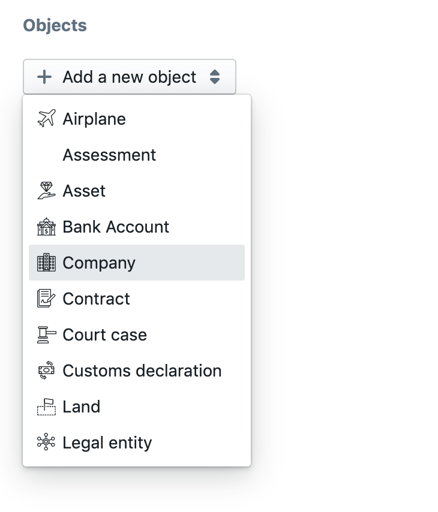
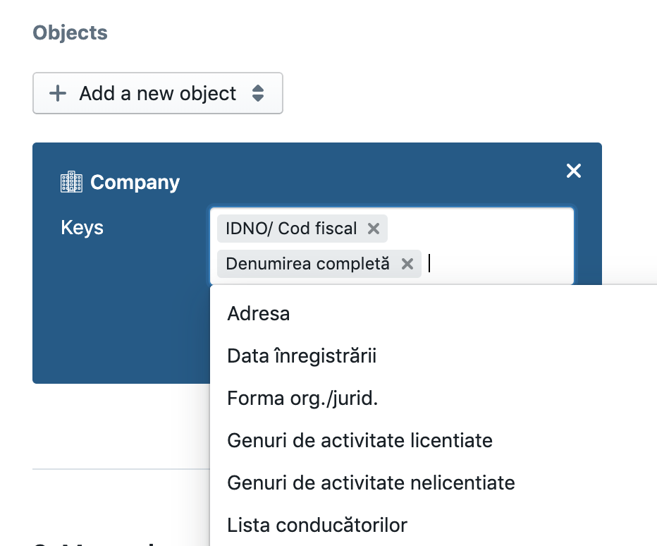
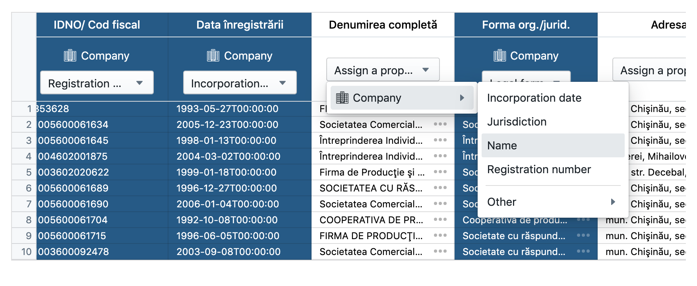
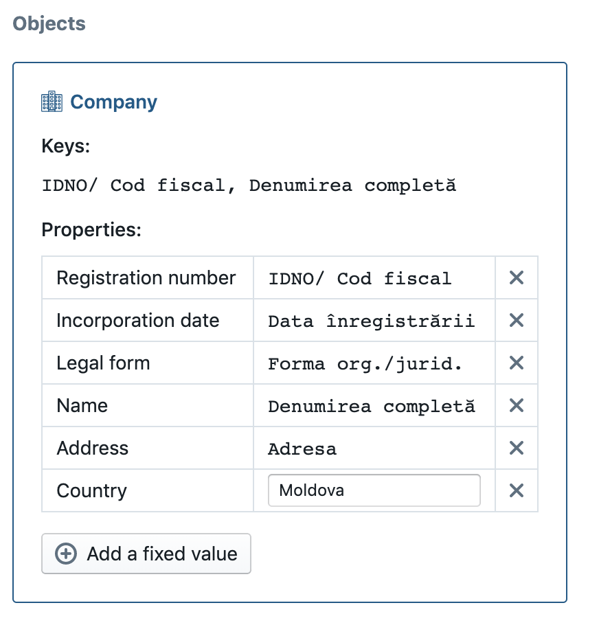

# Adding your own data

There are several ways for you to analyse and share your own data with Aleph. How best to do it is dependent on the type of data you are attempting to add and how frequently you would like to update it.

## Personal Datasets

**Personal Datasets** are contained workspaces within Aleph where you can upload, edit, and organize data related to an investigation or topic of interest - and they can be shared with any other user or access group within Aleph.

To create a Personal Dataset, click the "**Personal datasets"** button in the left sidebar on the homepage and then click the **"New dataset"** button. 

While source datasets like company registries and other evidentiary collections cannot be edited, **Personal Datasets** allow you to upload documents, map data into structured entities, and create your own network diagrams. 

## Importing documents and files

The most common type of data to import into Aleph is files, such as PDFs, E-Mail, or Word documents. Uploading them will make it easy to search them even if their text is hidden in images, and you can share them with your colleagues.


If you want to upload a small number of documents, you can do so directly in the Aleph interface as described below. However, when you're dealing with a **large trove of documents** \(such as a leak\) use the command-line based [alephclient tool](../developers/alephclient.md) to submit documents in an automated fashion.


1. **Create a personal dataset** \(see above\).

2. Then **upload your documents** using the upload function inside that dataset.  

You can share this personal dataset with colleagues who have accounts on the site and groups of users, but it cannot be made public.

### Recurring imports

If you plan to regularly import data from a public source, such as a government web site, you may want to [create a web crawler](../developers/memorious.md) that automatically executes, collects data and submits them to Aleph.

## Structuring your data

When **importing a list of companies, people or similar data objects**, it is helpful to convert your raw data into [structured entities](../developers/followthemoney.md) that Aleph can use to classify those entities for searching, cross-referencing, and many other operations.


For small and mid-size datasets, follow the instructions below to map your data into structured entities using the Aleph mapping editor. To map very large data straight from a SQL database, or to map complicated relationships, you will have to [create a mapping file](../developers/mappings.md) instead.


### Using the Aleph mapping editor

1. Follow the "Importing documents and files" steps above to **import your .csv, .xls, or .xlsx data file** to a personal dataset.

2. Once the data file has finished uploading, browse to one of the tables you have uploaded. C**lick the "Generate Entities" tab** to open the mapping editor.

3. **Select the types** of entities you would like to create from your data

4. **Define any relationships** - such as ownership or family relations - that exist between the entities.

5. **Select columns from your data to use as unique keys** for each entity**.** 

Keys are usually ID numbers, email addresses, telephone numbers, or other properties of your data which are guaranteed to be unique. The more columns you are able to select as keys, the better, to ensure that Aleph correctly generates an entity for each unique entry in your data.

6. **Assign data columns to properties** of the entity types you have selected. 

7.  **Add any fixed values to the entities.** If, for instance, your data is a company registry from Moldova, it would be useful to set the "Country" property to "Moldova", so that all company entities that are generated will automatically have their country set as Moldova.

8.  **Verify and submit your mapping**


When a mapping is submitted, Aleph will automatically generate structured entities based on the instructions you have provided it. It is important to note that **any** **future edits you make to the mapping will re-generate these entities.**  Additionally, deleting the mapping will delete any entities generated from it. 


