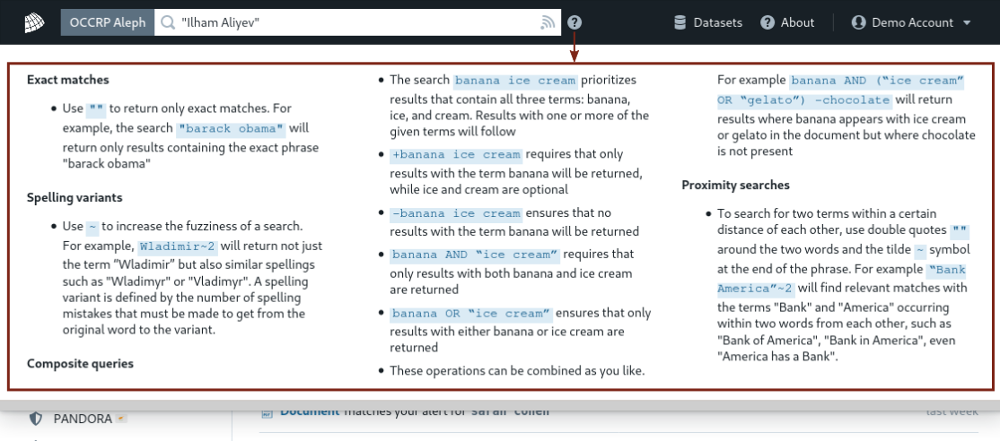

# Anatomy of a Search

### The Search Bar

Aleph's search bar is located at the top of the web page and is comprised of several distinct features:

* the search context
* the search form
* the create alert button
* the help button

#### The Search Context

The search context indicates what the scope of the search will be. There are three main scopes:

1. **OCCRP Aleph:** This scope will search all the datasets in Aleph and return the results. 
2. **Dataset:** This scope, indicated by the name of the dataset you are searching, is limited to only that dataset and no other datasets.
3. **Document:** This scope, indicated by the name of the document, is limited to the text inside only that document, and no other document in the dataset.

#### The Search Form

The search form is where you enter keywords and use search operators to expand or constrain the results of your search.

#### Create Alert Button

The create alert button enables you to create a saved alert based on the keywords and operators in the search form. Once saved, you will receive email notifications as well as see alerts in the notification tab when new data is added to Aleph that meet the requirements of your search.

#### Help Button

The help button displays a popup explaining the various operators/methods you can use in the search form to either expand or constrain your search.

### Highlighting Keywords in Search Results

When you type keywords in the search form, the set of results of the search are listed below, including the text containing those keywords highlighted in yellow. This allows you to eyeball the results and understand why they were returned based on your keywords. They can also help you decide if you need to either expand or narrow down your search.

### The Facets \(Filters\)

Aleph's search results page includes a list of filters to further narrow down your search results. These filters are located in the left-hand sidebar of the page.

### Export Button

Aleph enables you to download the results of your search as a spreadsheet. Just click on the export button in the top-right of the window to download the search results. Aleph limits the number of search results you can download to 10,000 results.

