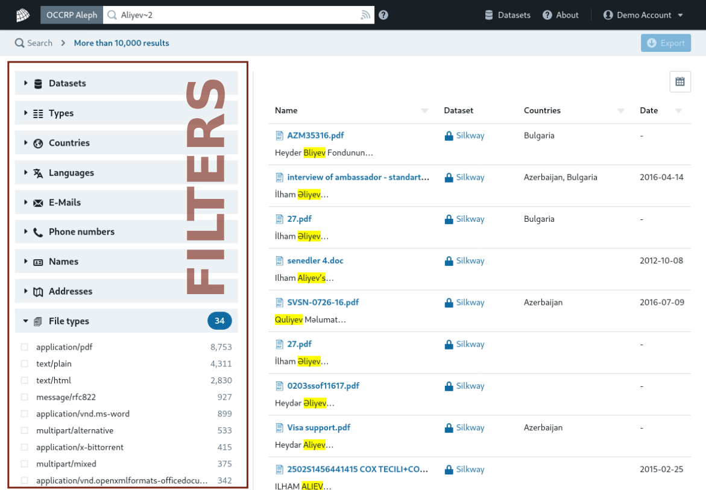
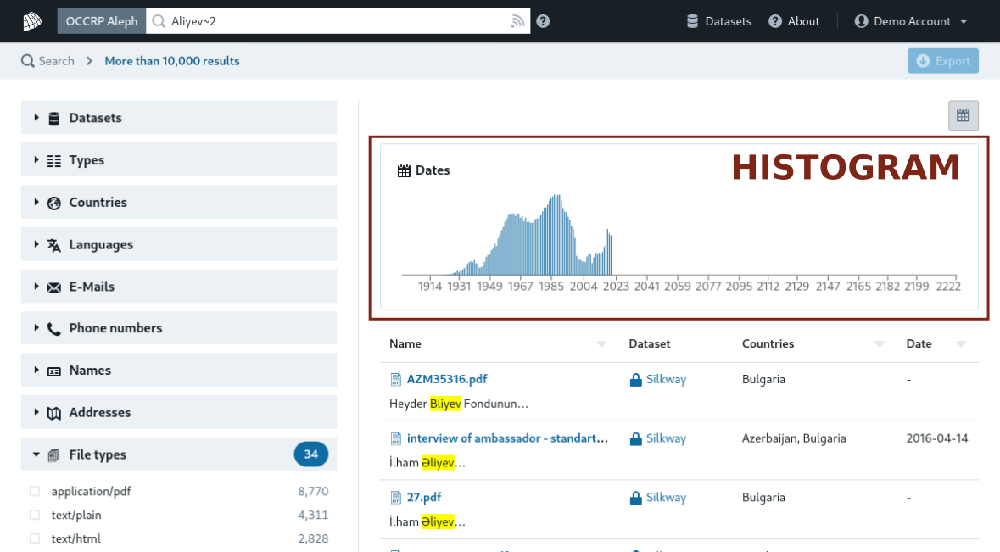
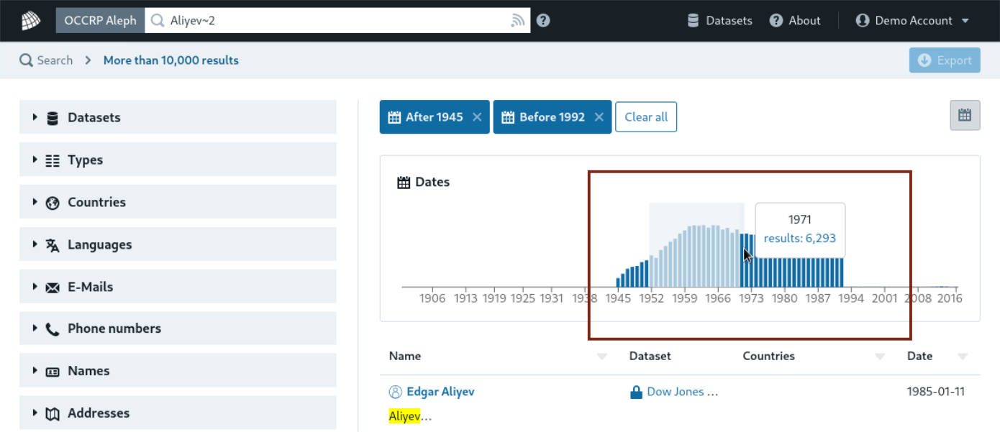

# Filtering Your Search Results

Once you have honed your search using the [advanced search methods](advanced-search-methods.md), you can further filter the search results by a number of built in filters including by country, type of data your are interested in \(document, company entity, web page, image, video, etc.\) , filetype, specific datasets, email addresses, phone numbers, bank accounts, names, language, and more.

Each filter type provides a list of checkboxes that will allow you to select exactly what you need to see. In addition, the checkbox options are sorted from most prevalent to least with the quantity of occurances beside it. This number can be quite useful, as it shows the most common options, giving you an indicator of where to start filtering to narrow down your search.

When you select a filter by clicking in the checkbox, a button appears above the search results indicating that the results are being filtered by that option. If you want to remove the filter, it is easy enough to click on the "X" in the button to remove it or click on the "Clear All" button to remove all the filters.

### Filtering By Date

You can also filter the search results by a date range. In the top, right-hand corner of the search page, click on the date range button.

The histogram does two things. Firstly, it gives you a visual distribution of your data by dates. This can be useful to just get a sense of the spread or _shape_ of your data. Secondly, the histogram itself is a filter and you can filter the documents by dates by clicking dragging your mouse cursor over the histogram, thereby selecting the dates you want to include in your search results.

Just like the other filters, when you filter the data by a date range, filter buttons appear at the top of the histogram, enabling you to see what filters exist and remove them if you no longer need them.

