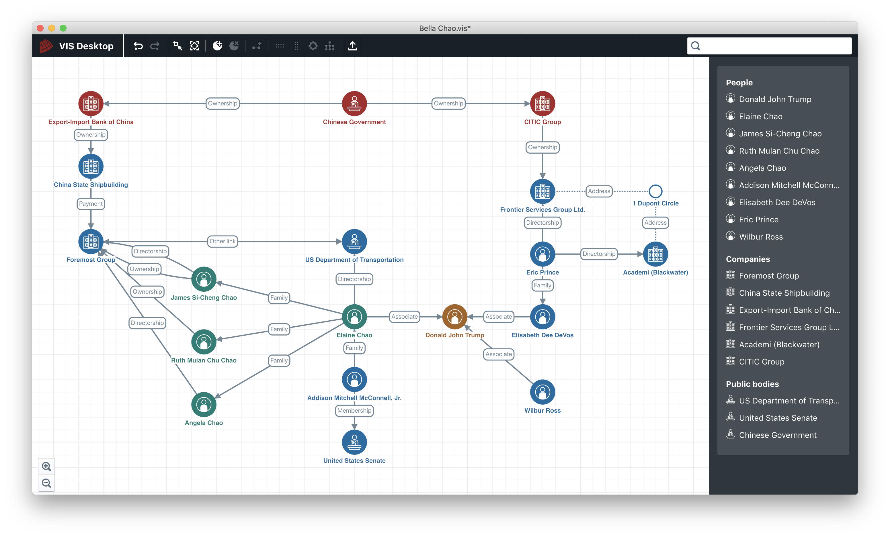
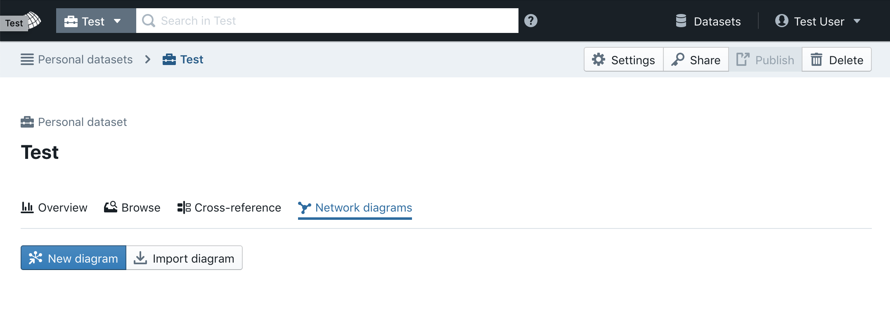
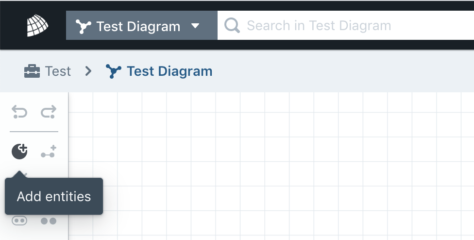
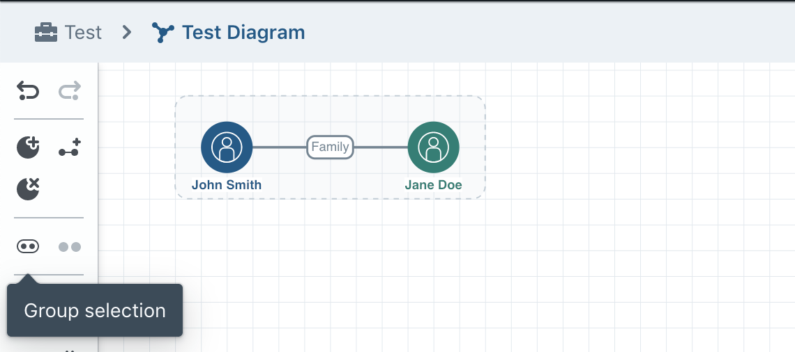

# Network Diagrams

Network diagrams let you sketch out networks of people, companies and other entities into a visual diagram of actors and connections. It uses the same [types of nodes and connections](../developers/followthemoney.md) as Aleph and runs both within the Aleph interface and on your desktop computer.

## Creating Diagrams in Aleph

### Creating your first diagram

Network diagrams can be created within any [Personal Dataset ](https://docs.alephdata.org/guide/loading-data#personal-datasets)you have access to on Aleph. To get started, click the "**Network diagrams**" button on any Personal Dataset page, and then the "**New diagram**" button.

You will now be able to map people, companies, and the relationships between them, which will be saved within your Aleph account, and only be visible to you and whoever you choose to share the diagram with.

### Adding entities to your diagram

To add people, companies, or other entities to your diagram, click the **"Add entities"** icon in the toolbar on the left side of the screen, or double click anywhere in the graphing area.

Once you have created multiple entities in your diagram, you can connect them by clicking the **"Add links"** icon.

Any entities and relationships you create within a diagram will automatically be added to the Personal Dataset in which your diagram was created.  This allows you to cross-reference the lists of people, companies, and other entities you have created in your diagrams with data from across the rest of Aleph.

### Sharing diagrams

Once you have created a diagram, you can allow others to view or edit it by allowing them access to the Personal Dataset in which it is contained.

You can also export your diagram to be saved as a file on your computer by clicking the "Export" button in the top right corner of the diagram editor. Once the diagram has been exported as a file, it can be edited using the Desktop application or shared with others as with any other file on your computer.

## Download the Desktop App

Creating network diagrams within Aleph allows you to map networks of people and influence directly alongside the rich ecosystem of data and processing tools that Aleph provides.  Sometimes, though, you might want to work on a diagram offline, within the private confines of your own device.

For this reason, we have created a desktop application, called Aleph Data Desktop, which is available for download on Github for ****[**Microsoft Windows**](https://github.com/alephdata/visdesktop/releases/latest/download/Aleph-Data-Desktop.exe)**,** [**Apple MacOS X**](https://github.com/alephdata/visdesktop/releases/latest/download/Aleph-Data-Desktop.dmg) ****and common [**Linux distributions**](https://github.com/alephdata/visdesktop/releases/latest/download/Aleph.Data.Desktop.deb).

Creating and editing diagrams within the desktop app works the same as  in Aleph, but allows you to work on your investigation files offline, with all data contained on your own device. Using the desktop app, investigation files can be created, edited, and shared as you would any other file on your computer, and will not be shared with others unless you explicitly decide to.

If you are interested, you are also welcome to explore and contribute to [the source code](https://github.com/alephdata/visdesktop) of the application. 

## Frequently Asked Questions

Below some of the common questions we've received about network diagrams. If you have another question or want to suggest an improvement, please [get in touch](../get-in-touch.md).

### How does this relate to OCCRP VIS?

[Visual Investigative Scenarios](https://vis.occrp.org/) \(VIS\) is an application developed by OCCRP, [RISE Project](https://www.riseproject.ro/) and [QuickData](http://www.quickdata.ro/) that is the inspiration for network diagrams. While it's been a beloved tool to some reporters, it has also become slow and cumbersome. We're unable to add new features and ensure its continued safety.

That's why we are planning to phase out the old version of VIS once Data Desktop has become stable and battle-tested. Our goal is to export all existing VIS diagrams so that they can be opened in Data Desktop, so that people can continue to work with their data. It's unlikely this transition will happen before 202.

### How much data can I add to a network diagram?

The goal of Data Desktop is to support investigative mind mapping, not big data analysis. While you may be able to add several hundred companies and people to a chart, the ideal size of a chart is somewhere around to 50-[150 entities](https://en.wikipedia.org/wiki/Dunbar%27s_number).

### Can I make entities into groups?

Yes. Simply select two or more entities, then click the "Group selection" button, as depicted below.

### Can I embed a diagram in an article?

Yes. In main the toolbar, you have an option to export an SVG graphic to a file. This SVG can be opened and "beautified" in a program like Adobe Illustrator or Inkscape \(open source\), and eventually published to the web as an image.

Please be conscious, however, that network diagrams are mainly intended to be investigative sketches. Their complexity can easily exceed the complexity we should force our readers to deal with. Be nice to the mortals.

### Can I import a spreadsheet of names and companies?

That'd be cool, right! We'll try to get it added soon.

